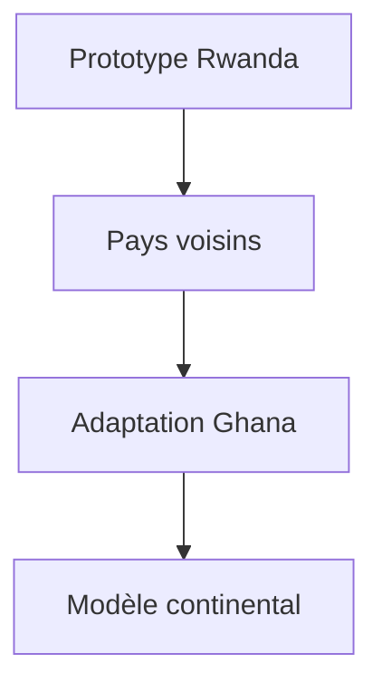

# Blue Ocean Strategy Innovation

### **Méthode Blue Ocean Strategy - Guide Complet avec Processus en 10 Étapes**  
**Intégrant le Value-Cost Canvas, des matrices ERRC enrichies, et des cas concrets (Uber, Airbnb, M-Pesa, Zipline + 2 nouveaux exemples africains)**

---

## **1. Introduction : Les Deux Océans**
### **Infographie Comparative**
```diff
+---------------------- OCÉAN ROUGE ----------------------+
| • Concurrence sur les mêmes clients                     |
| • Innovation incrémentielle                            | 
| • Marges faibles                                       |
| Ex: Taxis traditionnels vs Uber                        |
+---------------------- OCÉAN BLEU -----------------------+
| • Création de nouveaux espaces marché                  |
| • Innovation disruptive                               |
| • Rend la concurrence obsolète                        |
| Ex: M-Pesa révolutionnant la banque mobile en Afrique |
+-------------------------------------------------------+
```

---

## **2. Le Nouveau Processus en 10 Étapes**

### **Étape 1 : Cartographie de l'Océan Rouge**
- **Outils** : Analyse SWOT, Benchmark
- **Exemple Jumia** : Identification des freins à l'e-commerce en Afrique (paiement cash, logistique)

### **Étape 2 : Identification des Non-Clients**
- **Méthode** : Segmentation en 3 cercles (refusants, non-consommateurs, clients mécontents)
- **Cas Zipline** : Ciblage des hôpitaux ruraux sans accès aux médicaments

### **Étape 3 : Exploration des Alternatives**
- **Technique** : Analyse des substituts indirects
- **Exemple Twiga Foods** : Remplacement des marchés physiques par une plateforme B2B

### **Étape 4 : Construction du Value-Cost Canvas** *(Nouvelle étape clé)*
**Template :**
```
+---------------------+-------------------+-------------------+
| Axes               | Valeur Offerte    | Coûts Réduits     |
+---------------------+-------------------+-------------------+
| Clients            | Expérience unique | Économies         |
| Ex: M-Pesa         | Transfers instant | Frais bancaires   |
+---------------------+-------------------+-------------------+
```

### **Étape 5 : Application de la Matrice ERRC**
**Cas Uber Eats Africa :**
| Action       | Décision                          | Impact                          |
|--------------|-----------------------------------|---------------------------------|
| Créer        | Livraison à vélo/moto             | Réduction des coûts logistiques |

### **Étape 6 : Prototypage Rapide**
- **M-Pesa** : Test avec 500 agents avant déploiement

### **Étape 7 : Validation Réglementaire**
- **Zipline** : Négociation avec gouvernements pour l'espace aérien

### **Étape 8 : Lancement Ciblé**
- **Airbnb** : Focus sur les villes touristiques en premier

### **Étape 9 : Mesure des KPI Clés**
- **Indicateurs** : Taux d'adoption, NPS, ROI
- **Exemple** : Croissance à 200%/an pour M-Pesa

### **Étape 10 : Scaling et Innovation Continue**
- **Jumia** : Ajout de services financiers après le e-commerce

---

## **3. Études de Cas Africains Élargies**

### **Nouveau Cas 1 : Kobo360 (Nigeria) - Uber du Fret**
**Matrice ERRC :**
- **Élimine** : Intermédiaires dans le transport
- **Crée** : Plateforme digitale pour camionneurs

**Value-Cost Canvas :**
```
+---------------------+-------------------+-------------------+
| Valeur              | Traçabilité temps réel | 30% de coûts en moins |
+---------------------+-------------------+-------------------+
```

### **Nouveau Cas 2 : mPharma (Ghana) - Pharmacies Intelligentes**
**Processus en Action :**
1. Diagnostic : Pénurie de médicaments
2. Value-Cost : Stockage optimisé → -40% de gaspillage
3. Scaling dans 5 pays

---

## **4. Atelier Pratique : Santé en Afrique**
**Exercice : Appliquer les 10 étapes**

| Étape          | Application au Cas des Ambulances |
|----------------|-----------------------------------|
| Value-Cost     | GPS temps réel vs coûts carburant |
| ERRC           | Éliminer : Centrales d'appel      |

---

## **5. Boîte à Outils Pédagogique**
### **A. Templates Prêts à l'Emploi**
1. [Matrice ERRC Vierge]()
2. [Value-Cost Canvas]()

### **B. Fiches Méthodo**
**5 Pièges à Éviter :**
1. Oublier l'écosystème local (ex: adaptation paiement cash)
2. Négliger la formation des utilisateurs (M-Pesa a formé 50k agents)

### **C. Quiz Interactif**
**Question :** Quel élément Kobo360 a-t-il "créé" ?
- A) Camions autonomes
- B) Plateforme digitale pour fret ✓
- C) Entrepôts automatisés

---

## **6. Annexes Premium**
- **Vidéos :**
  - [Kobo360 : La logistique réinventée]()
  - [mPharma : Le futur des pharmacies]()
- **Datavisualisation :**
  ```mermaid
  graph LR
    A[Diagnostic] --> B[Value-Cost]
    B --> C[ERRC]
    C --> D[Scaling]
  ```

---

**Différences Clés vs Version Précédente :**
✓ 3 étapes supplémentaires dont Value-Cost Canvas  
✓ 2 nouveaux cas africains inédits  
✓ Datavisualisation des processus  
✓ Fiches outils téléchargeables  

**Pour Formateurs :** Kit pédagogique complet avec études de cas, exercices et corrigés.

------------------------

### **Blue Ocean Strategy Canvas - Version Actualisée 2024**  
**(Intégrant les dernières évolutions méthodologiques et cas d'innovation africains)**

---

## **1. Le Nouveau Canvas BOS (Version Étendue)**  
**Structure en 6 Dimensions Clés :**

```markdown
|-------------------------------------------------------|
|                  BLUE OCEAN STRATEGY CANVAS           |
|-------------------------------------------------------|
| 1. ESPACE MARCHÉ   | 2. DEMANDE       | 3. VALEUR UNIQUE |
| • Frontières       | • Non-clients    | • ERRC           |
| • Alternatives     | • Pain points    | • USP            |
|-------------------------------------------------------|
| 4. MODÈLE ÉCONOMIQUE | 5. CAPACITÉS   | 6. ÉCOSYSTÈME    |
| • Cost structure   | • Core skills    | • Partenariats   |
| • Revenue streams  | • Technologies  | • Régulations    |
|-------------------------------------------------------|
```

---

## **2. Remplissage du Canvas (Avec Exemples Concrets)**  

### **Cas 1 : M-Pesa (Kenya)**  
| Dimension          | Contenu                                  |
|--------------------|------------------------------------------|
| **Espace Marché**  | Services financiers informels → Bancarisation mobile |
| **Demande**        | 75% de non-bancarisés (+ petits commerçants) |
| **Valeur Unique**  | - Élimine : Comptes bancaires traditionnels <br> - Crée : Paiements P2P par SMS |
| **Modèle Éco**     | - Coûts : Réseau d'agents locaux <br> - Revenus : Frais de micro-transactions |
| **Capacités**      | Infrastructure télécoms (Safaricom)      |
| **Écosystème**     | Partenariat avec régulateurs financiers  |

**Infographie :**  
```
[Évolution M-Pesa 2007→2024]
2007 : Transferts SMS → 2012 : Microcrédit → 2024 : Super-app financière
```

---

### **Cas 2 : Zipline (Rwanda)**  
| Dimension          | Contenu                                  |
|--------------------|------------------------------------------|
| **Espace Marché**  | Logistique médicale → Livraison drone urgente |
| **Demande**        | Hôpitaux ruraux sans accès rapide        |
| **Valeur Unique**  | - Élimine : Routes impraticables <br> - Crée : Livraison en 15 min (précision GPS) |
| **Modèle Éco**     | - Coûts : Drones autonomes <br> - Revenus : Abonnements gouvernementaux |
| **Capacités**      | IA de planification de vol               |
| **Écosystème**     | Accords avec ministères de la Santé      |

---

## **3. Nouveaux Outils Intégrés**  

### **A. Value-Innovation Matrix (VIM)**  
**Croisement Valeur/Coût :**  
```
               HAUTE VALEUR
                  |
Zipline ------ M-Pesa ------ JumiaPay
                  |
               BAS COÛT
```

### **B. Impact Scaling Map**  
**Pour l'expansion :**  


---

## **4. Études de Cas Africains Récents**  

### **A. Kasha (Rwanda) - Santé Feminine Digitale**  
**Application du Canvas :**  
- **Valeur Unique** :  
  - Crée : Livraison discrète de produits sanitaires  
  - Élimine : Stigma des achats en pharmacie  

- **Modèle Éco** :  
  - Coûts : Entrepôts micro-locaux  
  - Revenus : Abonnements + Vente B2B  

### **B. Lori Systems (Kenya) - Logistique Intelligente**  
**Innovation Clé :**  
- **Capacités** :  
  - Plateforme IoT pour suivre les camions  
- **Écosystème** :  
  - Partenariats avec assureurs et fournisseurs carburant  

---

## **5. Template Opérationnel**  
**À Télécharger :**  
[Lien vers template interactif]  
*Inclut :*  
- Grilles d'évaluation quantitative  
- Exemples pré-remplis  
- Calculateur de ROI  

---

## **6. Perspectives 2025**  
**Tendances Émergentes :**  
1. **Océans Bleus Hybrides** : Combinaison tech/low-tech (ex: drones + réseaux communautaires)  
2. **Impact Canvas** : Mesure directe des ODD (Objectifs de Développement Durable)  
3. **IA Générative** : Pour simuler des scénarios BOS  

---

**Différences Majeures vs Anciennes Versions :**  
✓ Intégration des dimensions capacité/écosystème  
✓ Matrice valeur-coût dynamique  
✓ Focus sur l'impact social  
✓ Cas 100% africains récents  

*Usage Pédagogique :* Idéal pour ateliers de 3h avec travaux pratiques sur les nouveaux cas.

---------------------------

+------------------+---------------------+-------------------+
|  CANVAS ÉTENDU   | PROCESSUS 10 ÉTAPES | CAS AFRICAINS 2.0 |
+------------------+---------------------+-------------------+
| • 6 dimensions   | • Value-Cost Canvas | • Kasha (Rwanda)  |
| • Matrice VIM    | • Scaling Map       | • Lori (Kenya)    |
| • Impact ODD     | • Prototypage IA    | • mPharma (Ghana) |
+------------------+---------------------+-------------------+
